 

 

I make **native software that does one thing well**: a Mac reader that stays out of your way, a one-click tool that gets blocked sites loading again, an Android app that follows you from phone to TV. Mostly small, sharp tools that I use myself first.

 

## ✦ Featured work

<table>
  <tr>
    <td width="50%"></td>
    <td width="50%"></td>
  </tr>
  <tr>
    <td width="50%"></td>
    <td width="50%"></td>
  </tr>
  <tr>
    <td width="50%"></td>
    <td width="50%"></td>
  </tr>
</table>

 

## ✦ A closer look

**[Leaf Native](https://github.com/FurkanCodes/LeafNative)**: library, reader and notebook in one native macOS window.

  

**[Detour](https://github.com/FurkanCodes/detour)**: one click, and the sites your ISP blocks are back.

 

## ✦ Stack

 

**Want to talk?** Find me at [velifurkanturkoglu.me](https://velifurkanturkoglu.me)

